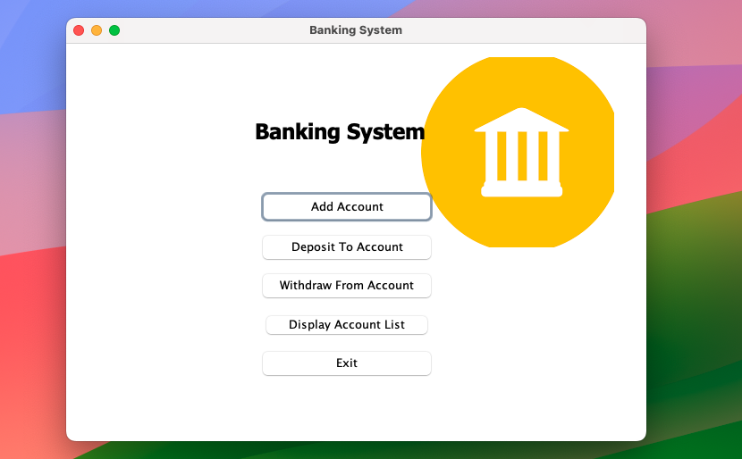

# 💳 Banking System – Java Swing Project

A **Java Swing-based desktop application** that simulates basic banking operations with a clean and user-friendly GUI. This project is designed to provide hands-on experience with Java programming and Swing components through real-world banking features.

---

## 🧩 Features

The application includes the following functionalities:

* 🧾 **Account Management**
  Create and manage individual bank accounts with unique identifiers.

* 💰 **Deposit & Withdrawal**
  Securely deposit or withdraw funds from a selected account.

* 📊 **Balance Inquiry**
  View real-time account balance and transaction summary.

* 📚 **Transaction History**
  Automatically tracks and displays transaction logs for every account.

* 🖥️ **Graphical User Interface**
  Intuitive and responsive UI designed using **Java Swing**.

---

## 🛠️ Technologies Used

* **Java** – Core programming language
* **Java Swing** – GUI framework
* *(Optional)* **File I/O** or **Serialization** – for storing account data locally (if implemented)

---
## 📷 Screenshots

<p align="center">
  
  <br/>
  <em>Account Dashboard</em>
</p>

<br/>

<p align="center">
  
  <br/>
  <em>Transaction Panel</em>
</p>


## 🚀 Getting Started

Follow these steps to set up and run the project locally:

### 1️⃣ Clone the Repository

```bash
git clone https://github.com/dhiraj7kr/BankingSystem.git
cd BankingSystem
```

### 2️⃣ Compile and Run

```bash
javac Main.java
java Main
```

> ⚠️ Make sure Java (JDK) is installed and configured in your system’s PATH.

---

## 🧑‍💻 Usage

Once the application is running:

1. **Launch the application**
2. **Create a new account** or **log in** to an existing one
3. Perform banking operations like:

   * Deposit funds
   * Withdraw money
   * Check balance
   * View transaction history

---

## 🤝 Contribution Guidelines

Contributions are welcome and appreciated! Here’s how you can help:

1. Fork the repository
2. Create a new branch
   `git checkout -b feature/your-feature-name`
3. Commit your changes
   `git commit -m "Add feature: your feature description"`
4. Push to your branch
   `git push origin feature/your-feature-name`
5. Open a Pull Request

We review and merge PRs regularly.

---

## 📜 License

This project is licensed under the [MIT License](LICENSE).
You are free to use, modify, and distribute this software.

---

## 🙏 Acknowledgments

* Huge thanks to **Java** for the language itself
* Special appreciation for **Java Swing**, enabling clean and interactive GUIs
* Thanks to open-source contributors and Java community members

---

## 📎 Notes

* This is a beginner-to-intermediate level project ideal for learning Java and desktop app development.
* Future enhancements could include:

  * Database integration (e.g., MySQL)
  * Login authentication
  * Interest calculations
  * Admin panel for bank staff

---


